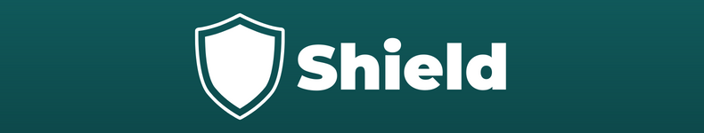
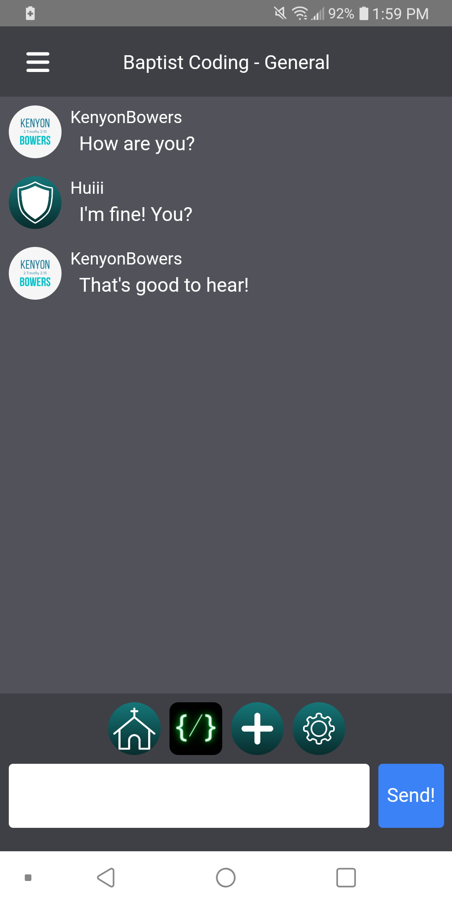
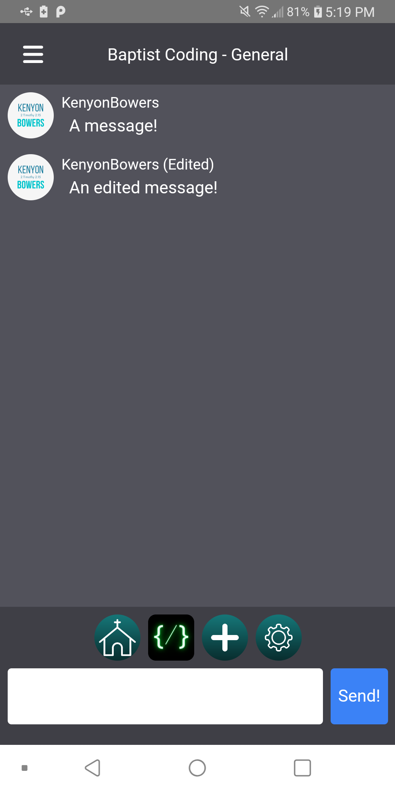

## What is it?
NerdChat was forked from another project called Shield from an Independent Fundamentalist Baptist. It is mainly just for testing purposes to see how stuff works and also to make a chat app for our "company", CBit. 

you can check out who we forked this project from  [here](https://kenyonbowers.itch.io/shield)
## Screenshots and Videos:

    
    

## Future Features:
- Profile Customization
- Account Modification
- Notifications on New Message Sent
- Replying to Messages